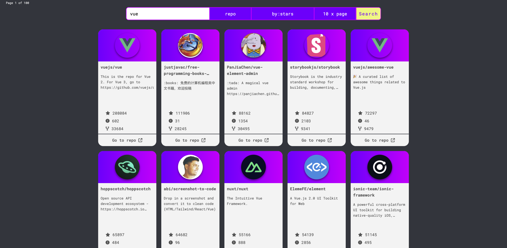

# GitHunt

🌐 [**Visita il sito web!**](https://thomas-mach.github.io/githunt/)

## Descrizione

**GitHunt** è una web app che consente agli utenti di cercare repository o profili utente su GitHub utilizzando l'API di GitHub. L'app è costruita con tecnologie moderne per il front-end e un server back-end per la gestione sicura del token privato di GitHub.

---

## Tecnologie utilizzate

### **Front-End**

- **HTML** e **CSS** per la struttura e lo stile.
- **Vue.js** per il framework front-end.
- **CSS Grid** per il layout responsivo.
- **Librerie**:
  - **Axios** per le chiamate API.
  - **FontAwesome** per le icone.
  - **SweetAlert (Swal)** per notifiche e avvisi.

### **Back-End**

- **Node.js** e **Express** per il server, utilizzato per gestire il token privato di GitHub e migliorare la sicurezza.

---

## Funzionalità principali

- **Ricerca utenti GitHub:** Inserisci un nome utente per ottenere i dettagli del profilo.
- **Ricerca repository GitHub:** Trova repository in base al nome o parola chiave.
- **Memorizzazione risultati con Session Storage:** I risultati delle richieste API sono memorizzati localmente utilizzando il session storage, migliorando la velocità dell'app e riducendo il numero di richieste API.
- **Layout responsivo:** Ottimizzato per desktop e dispositivi mobili.
- **Alert interattivi:** Utilizzo di SweetAlert per una migliore esperienza utente.
- **Gestione sicura del token GitHub:** Il token privato è gestito dal server Node.js per evitare esposizioni nel front-end.

---

## Screenshot

### **Home Page**

### **Risultati della ricerca**

---

## Possibili sviluppi futuri

- Migliorare i filtri di ricerca (es. linguaggi di programmazione, data creazione, ecc.).
- Aggiungere la possibilità di salvare i preferiti.
- Implementare un sistema di autenticazione con OAuth GitHub.

---
